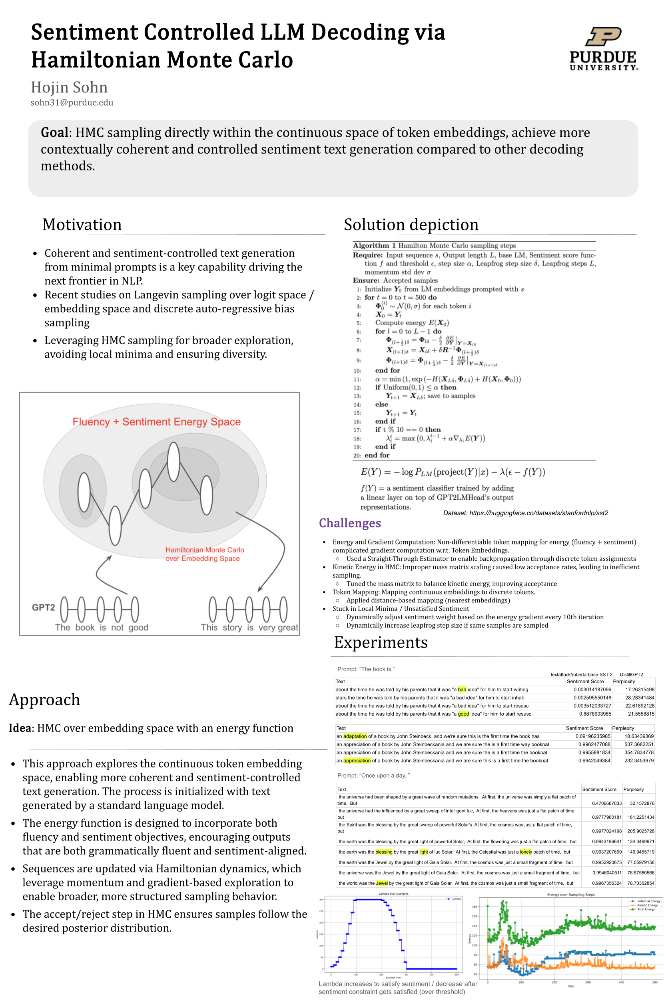

Project Summary: [Project PDF](docs/Presentation.pdf)


# Controlled Decoding via Hamiltonian Monte Carlo

This project uses **Hamiltonian Monte Carlo (HMC)** to guide the generation of **fluent, sentiment-controlled** text sequences from a pretrained language model (GPT-2). Specifically, it optimizes the **input token embeddings** of GPT-2 to generate **positive sentences** given a minimal prompt (e.g., `"The book"` → `"The book is very good"`).

---

## Motivation

Typical decoding methods like greedy search or beam search lack control over semantic properties such as **sentiment**. This project demonstrates a gradient-based alternative that leverages **Hamiltonian Monte Carlo** to explore the space of GPT-2 input embeddings, generating text that is both **coherent** and aligned with desired **attributes** (e.g., positive sentiment).

---

## Approach

- **Model**: GPT-2 (small)
- **Input**: Fixed prompt (e.g., `"The book"`), followed by **learnable token embeddings**
- **Objective**:
  - **Fluency Term**: Negative log-likelihood under GPT-2 (`-log P(y | x)`)
  - **Sentiment Term**: Positive sentiment score from a pretrained classifier
- **Optimization**: Hamiltonian Monte Carlo (HMC) samples embeddings from a posterior shaped by both fluency and sentiment

---

## Example Outputs

### Prompt:
The book is

**Generated Output:**
> The book is an appreciation of a book by John Steinbeckania and we are sure this is a first time the booknat

> The book is about the time he was told by his parents that it was "a good idea" for him to start resusc
---

### Prompt:
Once upon a time,

**Generated Output:**
> Once upon a time, the Spirit was the blessing by the great sweep of powerful Solar's   At first, the cosmos was just a flat patch of time,  but...

> Once upon a time, the world was the Jewel by the great light of Gaia Solar.  At first, the cosmos was just a small fragment of time, but...

---

## Compute Environment

All experiments and model training were conducted on the **Scholar computing cluster** provided by **Purdue University**.  
Used the **SLURM workload manager** to submit and schedule training jobs efficiently.

### Example SLURM Command
```bash
sbatch scholar.sh python main2.py \
  --device cuda \
  --lambda_energy 10.0 \
  --epsilon 0.7 \
  --n_steps 1000 \
  --std_dev 0.30 \
  --delta 0.1 \
  --num_leapfrog 10 \
  --alpha 0.1 \
  --prompt "Once upon a time," \
  --seq_length 25
```


## Dependencies

### Core Dependencies (for model training and optimization):
- `torch`
- `transformers`
- `numpy`

### Additional Libraries (for data recording and visualization):
- `gc` (for garbage collection)
- `pandas` (for data manipulation)
- `matplotlib` (for plotting)
- `csv` (for CSV file handling)
- `datetime`
